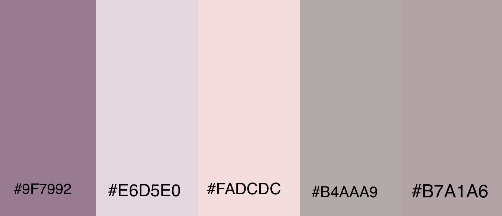

# Sweets N Treats - Portfolio Project 1
Sweets N Treats is aimed at anyone who is looking for a relaxing place to reset and chill out with some delicious treats. 

Sweets N Treats is also a pet friendly enviroment with plenty of fresh water stations and treats avaliable for your furry friends. 

## Live Link

## _User Experience_

### User Stories

- As a user, I want to be able to view what is on the menu.

- As a user, I want to be able to find out what the website is about. 

- As a user, I want to be able to follow the cafe on social media.

- As a user, I would like to find out where the cafe is and its opening times.

- As a user, I would like to be able to sign up for the cake competition. 

### First time visitor feedback
- 'My first time visiting the Sweets N Treats website was pleasent. The website is easily accessible on my device (iphone). I was able to navigate through the website and complete the competition without any faults.

## _Design_

### Colour scheme

I used [Canva](https://www.canva.com/colors/color-palette-generator/) to choose a colour scheme that would be easy to read and contrasting with background images. 

### Typography

Courier New, Courier, monospace is used as it is easy to read and inkeeping with simplistic design in which the website is based on. 

### Wireframes

For each of the sections in the scrolling webpage I used balsamiq to create wireframes.

- Home 

- Menu

- Contact 

- Cake Competition

## _Features_

These elements all have responsive design.

### Nav Menu

The nav menu appears on every page at the top allowing easy navigation throughout the website.

### Footer

The footer has links for following the cafe on social media and copyright label. 
The footer also has a link to my personal github page. 

### Home Page

This is the page you will find when opening the link to live website 

### Menu 

Here is the menu page the user will be taken too when clicking menu on the nav bar. 

### About us 

The about us section is where users will be greeted with whats to follow further down the page 

### Contact Us

Contact us section stating how to get in contact or visit us?

## Technologies Used

### Languages

In this project HTML 5 and CSS 3 was used. 

### Frameworks
Here is a list of the following technologies used in this project:
- [HTML5](https://en.wikipedia.org/wiki/HTML5)
HTML 5 was used to create the structure of the website
- [CSS3](https://en.wikipedia.org/wiki/CSS)
CSS 3 was used to style the website.
- [GitHub](https://github.com/)
GitHub was used to store the projects code.
- [Git](https://git-scm.com/)
Git was used for version control through github.
- [Gitpod](https://gitpod.io/)
Gitpod terminal was used to commit my code using Git and push it to Github.
- [Canva](https://www.canva.com/)
Canva was used to design colour palettes.
- [Balsamiq](https://balsamiq.com/)
Balsamiq was used to design the wireframes for the project.
- [Am I Responsive](https://ui.dev/amiresponsive)
Am I responsive was used to ensure the website is responsive on all devices and to showcase. 

## Deployment

### How to deploy a website

1. In the browser navigate to GitHub.
2. Click on 'Settings' on the topbar.
3. Select 'Pages' section down the right hand side.
4. Under source select 'Deploy'.
5. Select the dropdown 'main'.
6. Click 'Save'.
7. Now your Repository is live. 

### How to fork the website

1. In the browser navigate to GitHub
2. Click 'Fork' button at the top right of the page.

Live link to the website can be found [here](https://erickabarker.github.io/Sweets-N-Treats/)

### How to deploy locally

In order to make a local copy of this project, you can clone it. In your IDE Terminal, type the following command to clone my repository:

`git clone https://github.com/Erickabarker/Sweets-N-Treats`

Alternatively, if using Gitpod, you can click below to create your own workspace using this repository.

## _Testing_ 

Please click [here]() for all information about testing procedure.

## Accessibility 
I have tried to keep this website as simplistic and calming as possible. I have used soft colours and contrasts with easy to read text to suit everyone. 

The nav bar allows easy access to each part of the home page website. 

Responsiveness checker used to ensure the website is accessible on all formats.

## _Future Implementations_

- In the future I would like to implement a nav bar down the side of the website for ease of access down the page.
- In the future I would like to to implement a team page showcasing our staff and pet friends in the shop. 
- In the future I would like to create different pages rather than a scrolling page. 

## Credits

All code was written by me. 

Media images were taken from image website.
Chrome developer extension for troubleshooting.
Guidence on use of flex  
Colour palettes from .

## Acknowledgements 
My family and boyfriend for being very supportive throughout this project and new challenge.
Kera Cudmore for the guide on writing Readme.
My August group classmates for being so motivational and reassuring. 

